# Smart Fire Monitoring

Hệ thống giám sát và cảnh báo cháy theo thời gian thực, kết hợp ESP32, Firebase Realtime Database và ứng dụng Android Java.

## Tổng Quan

Project gồm 2 phần chính:

- **ESP32 Firmware**: đọc cảm biến, phát hiện nguy cơ cháy, điều khiển servo, bơm, còi và đồng bộ dữ liệu lên Firebase.
- **Android App**: hiển thị dữ liệu realtime, điều khiển từ xa, theo dõi lịch sử và cảnh báo cháy.

## Ảnh Giao Diện

### Màn Hình Chính

<table>
  <tr>
    <td align="center">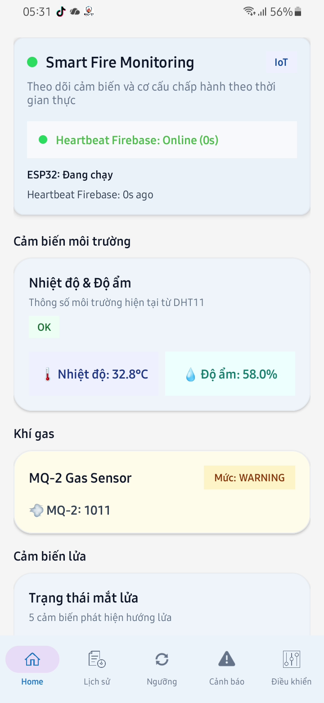</td>
    <td align="center">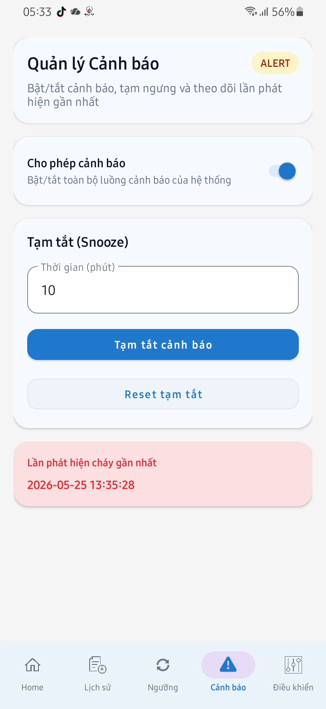</td>
    <td align="center">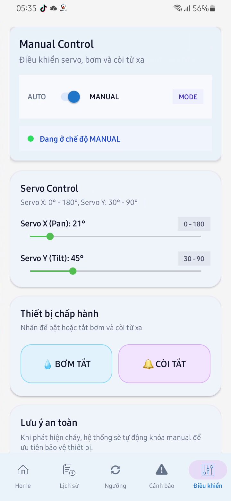</td>
  </tr>
</table>

### Lịch Sử Và Ngưỡng

<table>
  <tr>
    <td align="center">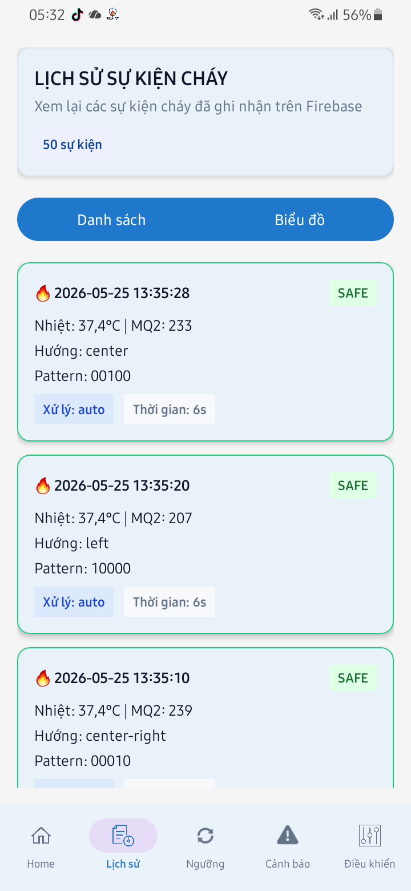</td>
    <td align="center">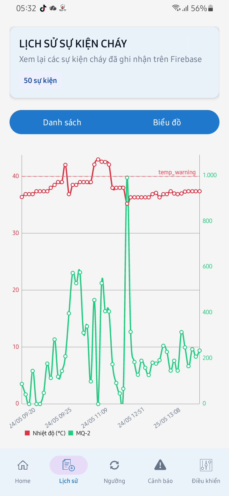</td>
    <td align="center">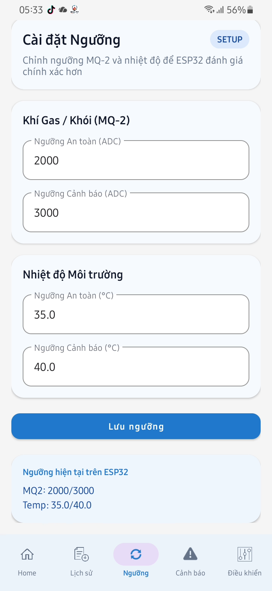</td>
  </tr>
</table>

### Cảnh Báo

<table>
  <tr>
    <td align="center">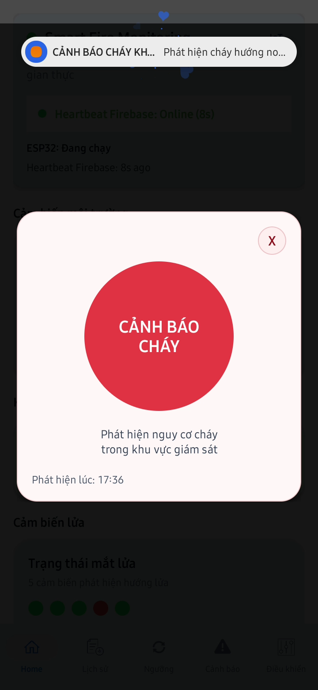</td>
    <td align="center">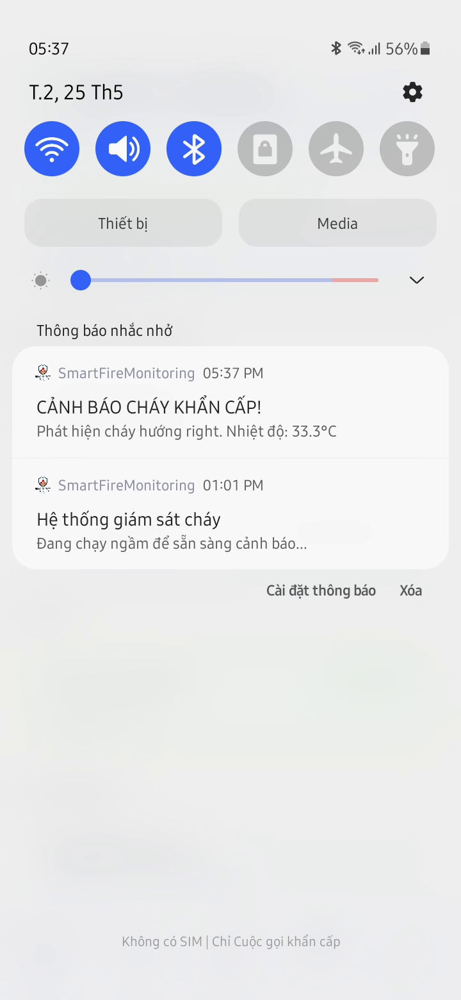</td>
  </tr>
</table>

### Mô Hình Hệ Thống Sau Khi Lắp Ráp

<table>
  <tr>
    <td align="center">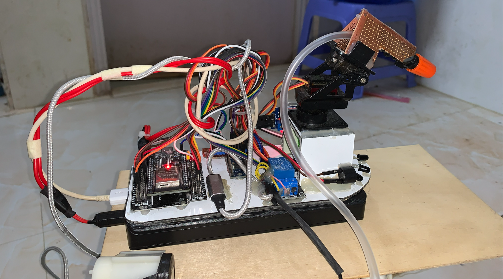</td>
    <td align="center">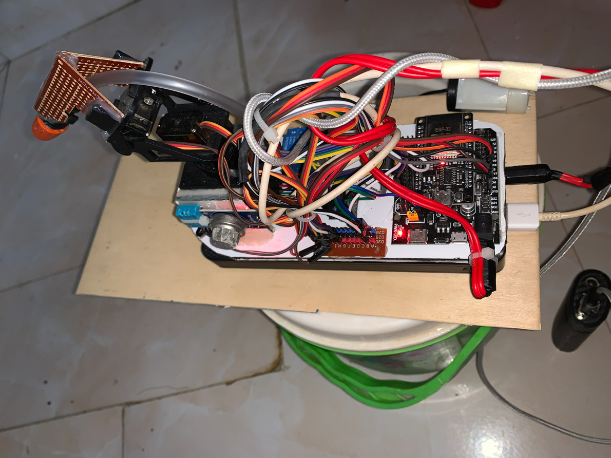</td>
  </tr>
  <tr>
    <td align="center">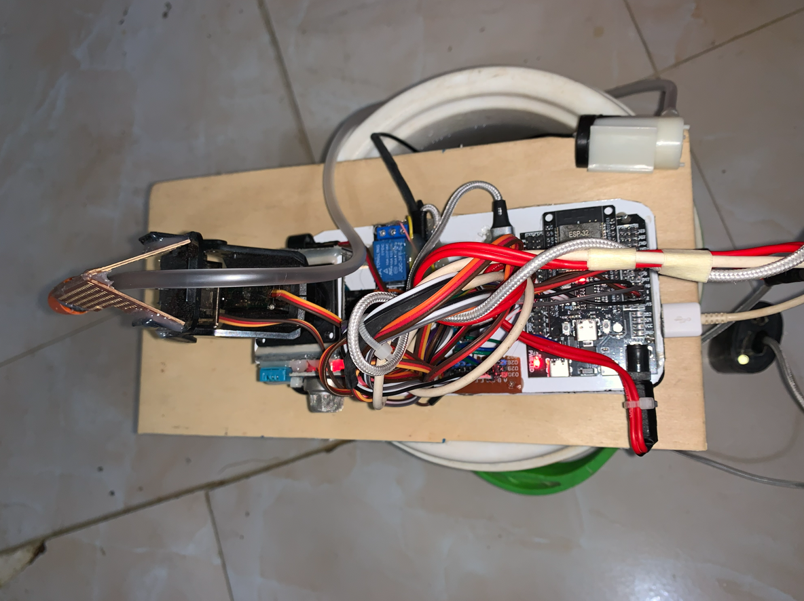</td>
    <td align="center">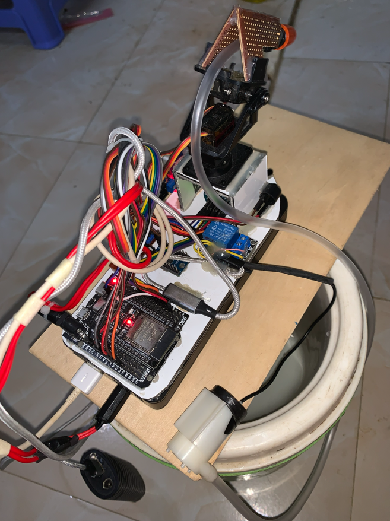</td>
  </tr>
</table>

## Chức Năng Chính

### Android App

- Dashboard realtime:
  - Nhiệt độ, độ ẩm
  - MQ-2
  - Trạng thái cảm biến lửa
  - Trạng thái bơm, còi, servo
- Cảnh báo cháy:
  - Notification
  - Dialog toàn màn hình
  - Tự mở khi phát hiện cháy
- Điều khiển thủ công:
  - Servo X / Servo Y
  - Bơm và còi
- Cấu hình hệ thống:
  - Ngưỡng MQ-2
  - Ngưỡng nhiệt độ
  - Bật/tắt cảnh báo, snooze
- Lịch sử:
  - Danh sách sự kiện
  - Biểu đồ thống kê

### ESP32 Firmware

- Đọc DHT11, MQ-2 và 5 cảm biến lửa
- Điều khiển servo pan/tilt
- Điều khiển bơm và còi
- Ghi dữ liệu lên Firebase RTDB
- Nhận lệnh realtime từ Firebase
- Tự chuyển sang chế độ an toàn khi có cháy

## Kiến Trúc Hệ Thống

```text
[Cảm biến] -> [ESP32] -> [Firebase RTDB] -> [Android App]
      |            |              |
      |            |              +-> Dashboard / History / Alert / Control
      |            +-> Servo / Pump / Siren
      +-> DHT11 / MQ-2 / Flame Sensors
```

## Công Nghệ Sử Dụng

- **ESP32**: Arduino IDE, Firebase ESP Client, ESP32Servo, DHT library
- **Android**: Java, Android Studio, Firebase Realtime Database, Firebase Auth, MPAndroidChart
- **Cloud**: Firebase Realtime Database, Firebase Anonymous Auth

## Cấu Trúc Firebase

```text
fire-alarm-system/
├── sensors/        (ESP32 ghi -> App đọc)
├── actuators/      (ESP32 ghi -> App đọc)
├── system/         (ESP32 ghi -> App đọc)
├── alert/          (App ghi <-> ESP32 đọc)
├── thresholds/     (App ghi -> ESP32 đọc)
├── control/        (App ghi -> ESP32 đọc qua Stream)
└── logs/           (ESP32 ghi -> App đọc)
```

## Cài Đặt Và Chạy

### Android App

1. Mở project bằng Android Studio.
2. Kiểm tra file `google-services.json` đã nằm trong `app/`.
3. Sync Gradle.
4. Build và chạy lên thiết bị Android hoặc emulator.

### ESP32

1. Mở firmware ESP32 trong Arduino IDE.
2. Cập nhật:
   - WiFi
   - Firebase URL
   - Firebase Auth
3. Upload code lên board ESP32.

## Tải APK

Người dùng có thể tải và cài trực tiếp file APK đã build từ GitHub Releases:

- [Tải APK release](https://github.com/duy-debug/smart-fire-monitoring-android/releases/latest/download/smart-fire-monitoring-android.apk)

### Cách build APK để phát hành

1. Mở project bằng Android Studio.
2. Chọn `Build` -> `Generate Signed App Bundle or APK...`.
3. Chọn `APK`.
4. Tạo hoặc chọn `keystore` để ký ứng dụng.
5. Chọn biến thể `release` và bấm `Finish`.
6. Sau khi build xong, file APK sẽ nằm trong:
   - `SmartFireMonitoring/app/build/outputs/apk/release/`

### Cài đặt trên điện thoại Android

1. Mở link tải APK trên điện thoại.
2. Tải file `smart-fire-monitoring-android.apk` về máy.
3. Nếu điện thoại chặn cài ứng dụng ngoài Google Play, vào `Cài đặt` và bật quyền `Cài đặt ứng dụng không rõ nguồn gốc` cho trình duyệt hoặc trình quản lý file.
4. Mở file APK vừa tải xuống.
5. Chọn `Cài đặt`.
6. Sau khi cài xong, mở ứng dụng `Smart Fire Monitoring` từ màn hình chính.

### Ghi chú khi chia sẻ cho người dùng

- File APK release được workflow GitHub Actions tự tạo và đính kèm vào `Releases`.
- Khi tạo tag version như `v1.0.0`, workflow sẽ build và upload file `smart-fire-monitoring-android.apk`.
- Nếu chỉ dùng để test nhanh nội bộ, bản `debug` vẫn có thể build từ Android Studio.

## Ghi Chú

- App hoạt động theo realtime Firebase RTDB.
- Notification và dialog cảnh báo cháy sẽ hiển thị khi hệ thống phát hiện cháy.
- Cấu hình Firebase và ESP32 phải đồng bộ thì app mới hiển thị đúng dữ liệu.

## Trạng Thái Project

- ESP32 Firmware: hoàn thành
- Android App: đang hoàn thiện và tối ưu UI/UX

